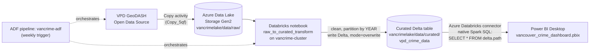

# Azure cloud pipeline — automated ingestion, transformation & BI connectivity

Extends the SQL + Power BI analysis in the main README with a fully automated
cloud pipeline: Azure Data Factory orchestrates a weekly refresh that pulls
fresh crime data from VPD's GeoDASH source, lands it in Data Lake Storage,
transforms it in Databricks into a curated Delta table, and Power BI connects
directly to that table for the dashboard — no manual CSV re-export needed to
keep the data current.

## Why

The original version of this project treated the VPD GeoDASH export as a
point-in-time snapshot: downloaded once, loaded into PostgreSQL by hand, and
never refreshed automatically. This pipeline turns the same analysis into
something that stays current with VPD's published data on its own,
demonstrating an actual ingest → transform → serve pattern rather than a
one-off analysis script.

## Architecture



| Layer | Service | Name |
|---|---|---|
| Orchestration | Azure Data Factory | `vancrime-adf` |
| Storage | Azure Data Lake Storage Gen2 | `vancrimelake` (container `data`) |
| Compute / transform | Azure Databricks | workspace `vancrime-databricks`, cluster `vancrime-cluster` |
| Serving | Power BI Desktop | `vancouver_crime_dashboard.pbix` |

## Pipeline steps

1. **Trigger** — `vancrime-adf`'s pipeline runs on a **weekly schedule
   trigger**, so the dataset refreshes automatically without manual
   intervention.
2. **Copy activity (`Copy_5qf`)** — pulls the latest crime incident export
   directly from VPD's GeoDASH open data source and lands it in
   `vancrimelake`'s `data/raw/` folder. This replaces the original project's
   one-time manual download with a repeatable, automated ingest.
3. **Notebook activity (`Notebook1`, running `raw_to_curated_transform`)** —
   runs immediately after the copy succeeds, on `vancrime-cluster`. It cleans
   the raw data and writes it out as a partitioned Delta table:
   ```python
   curated_path = f"abfss://data@{storage_account_name}.dfs.core.windows.net/curated/vpd_crime_data"
   (df_clean.write
       .format("delta")
       .mode("overwrite")
       .partitionBy("YEAR")
       .save(curated_path))
   ```
   This uses `.save(path)` rather than `.saveAsTable(...)` — the curated
   output is Delta files at a known path, not a table registered in the
   workspace's Unity Catalog metastore (`vancrime_databricks`).
4. **Power BI connection** — Power BI Desktop connects via the **Azure
   Databricks connector** (Get Data → Azure Databricks), authenticating with
   a personal access token, and reads the curated data with a native Spark
   SQL query against the Delta path directly (there's no registered table to
   browse):
   ```sql
   SELECT * FROM delta.`abfss://data@vancrimelake.dfs.core.windows.net/curated/vpd_crime_data`
   ```
   Loaded in Import mode alongside the project's original PostgreSQL-sourced
   tables.

## Setup notes / gotchas

- The Databricks cluster needs its own Spark-level storage credential
  (`fs.azure.account.key.<storage-account>.dfs.core.windows.net`) set in
  **Compute → cluster → Advanced options → Spark config**. A credential set
  only inside a notebook cell at runtime isn't visible to external JDBC/ODBC
  connections like Power BI's. For anything beyond a personal/portfolio
  project, this should go through a Databricks secret scope
  (`dbutils.secrets`) rather than a literal value in Spark config —
  Databricks itself flags the latter as a risk in the cluster UI.
- Power BI's Azure Databricks connector requires a **Default catalog** value
  to unlock its native-query box, even when the query only reads a path and
  never references the catalog — any valid catalog name in the workspace
  (e.g. `vancrime_databricks`) satisfies this.
- Authentication defaults to an organizational (Azure AD) sign-in prompt,
  which fails immediately for a personal Microsoft account — switch to the
  **Personal Access Token** tab in the credentials dialog instead.

## Relationship to the original analysis

The SQL-based neighbourhood trend analysis in the main README (PostgreSQL +
the five numbered `src/*.sql` scripts) is unchanged and remains the source of
the published findings. This pipeline is a parallel, cloud-native ingestion
path for the same underlying VPD dataset — built to demonstrate automated
data engineering (ADF orchestration, Databricks transformation, Delta Lake
storage, direct BI connectivity) alongside the analytical work.
